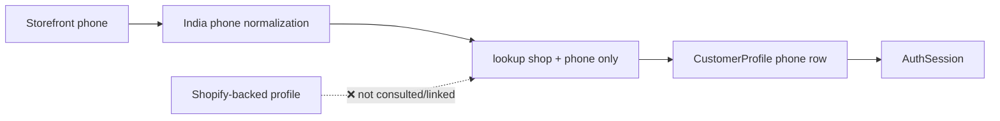
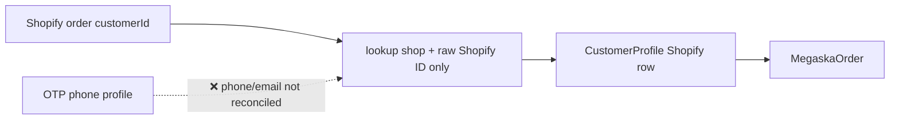
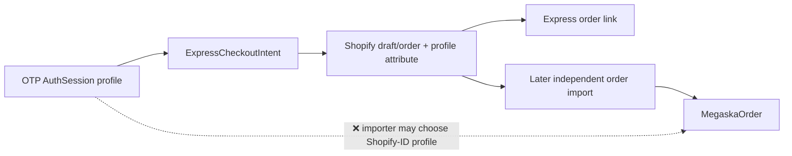
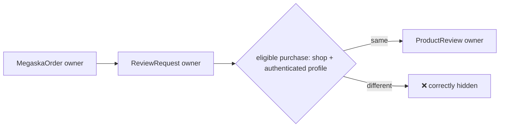
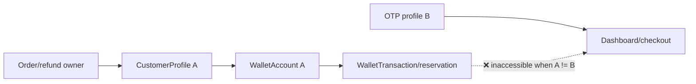

# IDENTITY-1A.1 — CustomerProfile Resolution Audit

**Audit date:** 2026-07-19  
**Scope:** Static, repository-wide identity audit. No production behavior or data was changed. No repair script was run.

## Executive summary

The repository does **not** have an actively adopted canonical `CustomerProfile` resolver. There are **five direct create statements in five resolver/write functions, of which four functions have active production/admin entry points**:

1. `syncCustomersForShop` (`lib/customer-sync.ts:15-126`), called by `pages/api/admin/customers/sync.ts`;
2. `syncSingleCustomerForShop` (`lib/customer-sync.ts:136-259`), called by `pages/api/admin/customers/sync-one.ts`;
3. OTP `POST` (`app/api/otp/verify/route.ts:24-330`);
4. `syncCanonicalShopifyOrder` (`services/orders/shopify-order-sync.ts:50-100`), called by the admin dev-order import through `services/dev-tools/import-shopify-order.ts`;
5. `resolveShopifyCustomerProfile` (`services/customers/resolve-shopify-customer.ts:8-25`), which has no non-test/static caller and is therefore classified **Legacy or dead / not adopted**.

The strongest, code-confirmed explanation for the reported order/session split is the dev/manual Shopify order ingestion path. `syncCanonicalShopifyOrder` looks up **only** `(shopId, source.customerId)` and, on a miss, creates a sparse Shopify-ID-only profile (`services/orders/shopify-order-sync.ts:57-60`). It neither normalizes the source ID nor reconciles phone/email. OTP independently looks up **only** `(shopId, normalized Indian phone)` and creates a phone-only profile (`app/api/otp/verify/route.ts:247-264`). Thus either ordering produces two records whenever the first record lacks the lookup key used by the second. Order sync then assigns/reassigns both `MegaskaOrder` and new `ReviewRequest` records to its Shopify-ID profile (`services/orders/shopify-order-sync.ts:62-98`). Reviews correctly filter by authenticated profile and reveal—not cause—the split.

The database prevents duplicate non-null `(shopId, shopifyCustomerId)` values but only indexes phone/email. It permits duplicate `(shopId, phoneE164)` and `(shopId, email)`, permits nullable `shopId`, and cannot prevent find-then-create races for phone identities (`prisma/schema.prisma:10-50`). The Shopify-ID advisory-lock resolver prevents races for one exact normalized Shopify ID, but it cannot link a pre-existing phone-only profile and is not used by the active paths.

**Finding:** the intended future canonical implementation is the appropriately named `resolveShopifyCustomerProfile`, but it is only a Shopify-ID serialization primitive, not yet the required multi-identifier resolver. It must be expanded/replaced behind a repository boundary and adopted atomically by every creator; adding a sixth resolver would worsen the problem.

## Confirmed current symptom

Reported UAT state:

| Record | `customerProfileId` |
|---|---|
| Shopify/imported `MegaskaOrder` | `d058f0e6-2544-4852-ae48-c4c8263162c9` |
| authenticated OTP session | `c2281142-a9dc-468a-99da-848a725e62dc` |

The observed diagnostic (`reviewRequestCountBeforeCustomerProfileFilter: 1`, after: `0`) is consistent with the implementation. Eligible-purchase queries add `customerProfileId` to the shop/order criteria (`services/reviews/review-eligible-purchases.ts:21-32`). Candidate sync copies `order.customerProfileId` to a new request and merely reports an integrity warning when enriching an existing request; it does not rewrite ownership (`services/reviews/review-candidate-sync.ts:18-21`). This security boundary is correct and must not be weakened.

Static inspection establishes the mechanism but cannot prove which runtime invocation created either supplied UUID. Correlating those UUIDs to `createdAt`, `updatedAt`, audit events, order metadata, and deploy logs is a safe follow-up diagnostic.

## CustomerProfile write inventory

| Classification | File / function | Caller and trigger | Tenant source | Identity input and lookup order | Create/link/overwrite | Transaction and race assessment |
|---|---|---|---|---|---|---|
| **Compatible but independent; conflict-unsafe** | `lib/customer-sync.ts:15` `syncCustomersForShop`; create at `:108` | `pages/api/admin/customers/sync.ts:64`; admin bulk Shopify sync | authenticated admin's `shop.id` plus selected domain | Normalize Shopify ID, email, phone; lookup Shopify ID → phone → email (`:40-98`) | Creates; updates the selected row with all payload fields including Shopify ID (`:100-110`). If Shopify ID and phone/email identify different rows, it silently selects Shopify-ID row and can overwrite its contact fields; if phone row is selected, linking can hit unique conflict. | No transaction/lock. Non-Shopify keys are not unique; concurrent reads can create duplicates. |
| **Compatible but independent; conflict-unsafe** | `lib/customer-sync.ts:136` `syncSingleCustomerForShop`; create at `:246` | `pages/api/admin/customers/sync-one.ts:73`; targeted admin sync | authenticated admin shop/domain | Search Shopify by normalized phone/email; choose OR match or first candidate; local lookup Shopify ID → phone → email (`:143-235`) | Same link/update behavior as bulk. Candidate fallback (`:177`) may link an unexpected Shopify customer when upstream search is ambiguous. | No transaction/lock; race-prone. |
| **Unsafe** | `app/api/otp/verify/route.ts:24` `POST`; create at `:258`, update at `:266` | Storefront OTP verification | `requireStorefrontShopFromRequest` (`:26`) | `normalizeIndianPhone`; lookup shop + phone only, newest row (`:46`, `:247-255`) | Creates phone-only verified profile; never looks up Shopify ID/email or detects conflicts. Sets `phoneVerifiedAt`; creates challenge/session ownership (`:276-295`). | Profile, challenge, and session writes are not one transaction. No phone unique constraint or lock: simultaneous verifies can duplicate. |
| **Unsafe — confirmed discontinuity** | `services/orders/shopify-order-sync.ts:50` `syncCanonicalShopifyOrder`; create at `:60` | `services/dev-tools/import-shopify-order.ts:21` → `app/api/admin/dev-tools/orders/import/route.ts`; manual/import sync | admin-resolved `shopId` and `shopDomain` | Exact raw `source.customerId` only (`:55-60`) | Creates Shopify-ID-only profile, does not phone/email-link. Every retry updates an existing order's owner to the row selected now (`:62-76`), so ownership can switch; review creation uses the same selected row (`:78-98`), while pre-existing review requests remain under their unique key and are not reassigned. | No transaction/lock around profile/order/reviews. Same-ID create is blocked only if representation matches existing canonical storage; races can throw P2002. |
| **Legacy or dead / not adopted; narrow canonical primitive** | `services/customers/resolve-shopify-customer.ts:8` `resolveShopifyCustomerProfile`; create at `:21` | No repository caller found | mandatory input `shopId` | canonical numeric Shopify ID only (`:12-18`) | Creates/returns Shopify-backed row; accepts arbitrary create attributes, but cannot match/link phone/email or handle cross-profile conflict. | Transaction plus per-shop/per-ID PostgreSQL advisory lock (`:15-23`); safe for same canonical Shopify ID only. |
| **Compatible update only** | `services/express-checkout/address.ts:94` `saveCustomerProfileAddress`; updateMany at `:102` | checkout address save | supplied shop + profile | ID/shop scoped | Updates address/contact; no create | Single update; cannot duplicate. |
| **Compatible update only** | `app/api/profile/complete/route.ts`; updates at `:140`, `:196` | authenticated profile completion / Shopify linkage | storefront shop/session | session profile; Shopify customer lookup/create is remote, then local row updated | Can attach Shopify ID to current OTP row. Unique conflict is handled, but conflict recovery must be treated cautiously because it does not constitute a general merge. | Multiple local/remote steps, not a single identity transaction. |
| **Compatible update only** | `app/api/dashboard/summary/route.ts`; update at `:271` | dashboard hydration | session/shop | session profile | Enriches profile; no create | Does not resolve divergence. |
| **Destructive, development-only** | `scripts/dev-repair-customer-profile-duplicate.mjs`; delete at `:85` | explicit CLI with environment gates and four IDs | validates both profiles share non-null shop | requires both IDs normalize to same Shopify ID | Moves only one named order and one named review, refuses delete if any FK remains | One transaction and advisory lock; deliberately not a general merge. |

No `customerProfile.upsert`, `updateMany` other than address enrichment, `deleteMany`, or additional dynamic-delegate creates were found by repository-wide searches for `prisma|tx|db.customerProfile.*`. The schema-generated client and dependencies were excluded as generated/vendor code.

## Resolver/read-path comparison

| Resolver | Tenant scoped | Shopify ID | Phone | Email | Normalization | Can create | Can merge/link | Classification |
|---|---:|---:|---:|---:|---|---:|---:|---|
| `syncCustomersForShop` | Yes | First | Second | Third | shared customer normalizers | Yes | Link, but no conflict policy | Compatible independent / unsafe on conflict |
| `syncSingleCustomerForShop` | Yes | First locally | Second | Third | shared customer normalizers | Yes | Link, but ambiguous upstream OR match | Compatible independent / unsafe on conflict |
| OTP `POST` | Yes | No | Only | No | India-only OTP helper | Yes | No | Unsafe |
| `syncCanonicalShopifyOrder` | Yes | Only, raw | No | No | order ID only; customer ID not normalized | Yes | No | Unsafe |
| `resolveShopifyCustomerProfile` | Yes | Only | No | No | canonical numeric ID | Yes | No | Legacy/not adopted; safe same-ID serialization |
| `findShopifyCustomerIdByIdentity` | Shopify API request is domain scoped; no local profile | Result only | First | Second | India E.164 + lower email | Remote read only | No local link | Compatible lookup helper |
| `findOrCreateShopifyCustomer` | Domain is implicit/default in several calls and must be reviewed | Result only | Second | First | email lowercased; phone merely trimmed | Creates **Shopify** customer, not profile | No local merge | Unsafe as an identity policy dependency |
| Dashboard/session resolvers (`requireCustomerSessionForShop`, `resolveCustomerDashboardContext`) | Yes via profile shop | No | No | No | token hash only | No | No | Canonical authentication context, but faithfully returns whichever profile OTP chose |

There are multiple competing resolver generations. The shared bulk/single code has the broadest matching but is duplicated. The transaction resolver is clearly intended as a reusable canonical primitive (name/comment/lock), yet is unused and incomplete. OTP and order import bypass both.

## OTP trace

1. `/api/otp/request` normalizes with `services/auth/otp.ts:373-374`, which delegates to `services/phone.ts:7-21`, and stores a shop-scoped challenge.
2. Verification resolves the shop before body processing, applies the same India-only normalizer, and reads a pending challenge by shop/phone.
3. After provider approval it reads the newest profile by shop/phone only.
4. It creates a verified phone-only profile or marks that selected row verified.
5. It writes the selected ID onto the OTP challenge and a new `AuthSession`.
6. `requireCustomerSessionForShop` and dashboard context subsequently use the session relationship; dashboard context rejects a profile belonging to another shop (`services/customer-dashboard/context.ts:59-97`).

OTP does **not** query Shopify, compare `shopifyCustomerId`, call either customer-sync function, or invoke `resolveShopifyCustomerProfile`. A Shopify-ID-only row created by order import is invisible to it. A phone-only row is invisible to order import. Because phone is non-unique, `orderBy createdAt desc` makes the most recently created duplicate the login owner, which can shift future sessions.

## Shopify synchronization trace

Both functions in `lib/customer-sync.ts` are active admin tools and use the same local precedence: canonical numeric Shopify ID, normalized phone, normalized email. They are the closest current behavior to desired reconciliation, but they do not query all identifiers simultaneously and reject conflicts. They can silently enrich/link one record while leaving another duplicate untouched.

`resolveShopifyCustomerProfile` appears to be a later hardening generation: it canonicalizes GID/numeric forms and uses an advisory transaction lock. There are no active callers. It guarantees idempotence only for one Shopify ID; it cannot discover the OTP phone profile.

Behavior with missing data: bulk requires Shopify ID but phone/email may be null; single requires a lookup phone/email and a matched Shopify result. All use numeric Shopify IDs after normalization except `syncCanonicalShopifyOrder`, whose source currently appears numeric in review-source mapping but whose resolver itself does not enforce that contract. Repository policy should not rely on that incidental producer representation.

## Shopify order ingestion and synchronization

The only `MegaskaOrder.create` identity-ingestion implementation found is `syncCanonicalShopifyOrder`. Its active repository caller is the admin dev import. Shopify `orders/create` webhook code writes/validates Shopify order metadata and checkout linkage, but static inspection found no call to `syncCanonicalShopifyOrder` and no `MegaskaOrder.create`; therefore webhook-to-local-order ingestion outside the dev importer is **Unknown/not implemented in this repository path**, not safe to infer.

The importer:

* requires a Shopify customer;
* resolves only by `source.customerId`;
* creates a sparse profile if absent;
* overwrites `customerProfileId` whenever it updates the order;
* creates review requests with that selected ID;
* does not update an existing request returned by its unique `(shop, order, line)` key.

Accordingly, repeated sync is order-idempotent but not ownership-immutable: it can switch the order to a newly selected profile while leaving an existing review request behind, creating an additional internal ownership inconsistency.

## Express Checkout identity continuity

The checkout intent takes `auth.customer.id` from the verified session and scopes reusable intents by `(shopId, customerProfileId)` (`app/api/express/checkout/intents/route.ts:184-265`). Address, discounts, Razorpay, COD, partial COD, payment verification, and store-credit routes consistently pass the authenticated profile ID and shop.

Prepaid finalization re-reads the intent by that profile, embeds `megaska_customer_profile_id` as a Shopify draft-order custom attribute, and attaches a Shopify customer GID only when the same local profile already has `shopifyCustomerId` (`services/express-checkout/order-finalization.ts:184-246`). It writes the Shopify order link and consumes the reservation with the same profile (`:267-278`). Recovery tokens and intent/address models carry profile IDs.

**❌ Discontinuity:** finalization does not create a `MegaskaOrder`. A later independent import resolves the finished Shopify order by Shopify customer ID only and can replace continuity with another profile. The webhook reads the custom profile attribute, but the audited local order importer ignores it. If OTP's profile lacks Shopify ID, draft order creation may also omit `customerId`, making subsequent linkage even less reliable. Thus Express Checkout preserves identity inside its own records but cannot guarantee that the eventual `MegaskaOrder` has the same owner.

## Reviews trace

```text
MegaskaOrder.customerProfileId
  -> ReviewRequest.customerProfileId (copied on creation)
  -> eligible-purchases WHERE shopId + customerProfileId
  -> ProductReview.customerProfileId (copied after ownership eligibility)
```

`createOrGetReviewRequest` verifies that order, shop, and customer agree before creating. Candidate sync copies order ownership and, for an existing request, enriches snapshots rather than reassigning identity. Submission eligibility and creation require shop/profile/order/request agreement. Reviews therefore enforce the correct security boundary. Duplicate identities cause invisibility; removing the filter would create cross-customer access.

Review ownership is not schema-immutable—the column can be updated, and the dev repair does so—but normal candidate synchronization treats it as immutable. A future controlled merge must update order/request/review together and preserve verified-purchase integrity.

## Wallet and store credit

`getOrCreateWalletAccount` and customer store-credit APIs key off the passed/session `customerProfileId`. The schema allows one wallet per `(shop, profile, currency)`, not per real-world customer (`prisma/schema.prisma:1753-1769`). Transactions redundantly hold both wallet and customer profile ownership and use source idempotency (`:1772-1801`). Reservations also carry profile ownership.

Duplicate profiles can therefore legitimately create two wallet accounts, split the balance/ledger, hide a refund credit placed on the order/refund profile from the OTP dashboard, and prevent a reservation from being located/released by the other profile. Liability totals may remain arithmetically present but customer-level analytics and access are wrong. A merge cannot delete/recompute transactions: it must reconcile wallet accounts, preserve transaction IDs/source idempotency, retarget every transaction/reservation consistently, and prove that the sum of immutable ledgers equals the resulting balance.

## Post-purchase, dashboard, and API ownership matrix

| Module | Ownership source / enforcement | Duplicate symptom | Classification |
|---|---|---|---|
| Dashboard/orders/tracking/timeline | AuthSession profile; queries shop + profile | Valid orders/tracking/timeline disappear | Canonical consumer; affected |
| Reviews | Order → request; session filters requests/submissions | Eligibility/reviews disappear | Canonical security consumer; affected |
| Express intent/address/payment/COD | OTP session profile propagated | Checkout internally coherent; later imported order may diverge | Compatible until ingestion boundary |
| Wallet/store credit/reservations | Session or refund/order profile | split/inaccessible balances, release/consume failures | Canonical consumer; financially affected |
| Cancellation and issue routes | Auth session profile; create/list/get scoped by shop/profile | valid order/request hidden or new request associated with session side of split | Canonical security consumer; affected |
| Exchange routes/auth | Auth session plus order/request ownership | exchange missing/denied | Canonical security consumer; affected |
| Customer refunds | Auth session profile (`services/refund/customer-refunds.ts:111-131`) | refunds credited/listed under other profile are hidden | Canonical security consumer; affected |
| Admin refunds/store-credit settlement | refund/order persisted profile | credit may land on order profile, not login profile | Compatible consumer; financially affected |
| COD refunds / reverse pickup / logistics | request/customer persisted relationship | operational record follows whichever request profile was used; customer may not see it | Compatible consumer; affected |
| Saved/profile address | profile row and checkout snapshots | addresses duplicated/stale/inaccessible | Compatible consumer; affected |
| Abandonment/recovery | intent/token optional profile | recovery belongs to OTP profile while imported order can belong elsewhere | Compatible consumer; affected |
| Notifications | request/profile email/phone snapshots | notification may use stale duplicate or be suppressed | Compatible consumer; affected |
| Admin customer/wallet pages | selected profile ID | duplicate customer rows and separate wallets | Compatible consumer; affected |

Most post-purchase modules do not create identity; they correctly trust or compare persisted order/request ownership with authenticated ownership. Divergence consequently presents as missing data or authorization denial rather than cross-customer disclosure. Any remediation must preserve those comparisons.

## Identifier normalization comparison

### Phone

| Input | `lib/customer-normalize.normalizePhone(...,"IN")` | OTP / `services/phone.normalizeIndianPhone` | Shopify admin `normalizeIndianPhoneToE164` |
|---|---|---|---|
| `+919876543210` | `+919876543210` | same | same |
| `919876543210` | `+919876543210` | same | same |
| `9876543210` | `+919876543210` | same | same |
| spaces/hyphens/parentheses around a valid 10/12-digit Indian value | stripped to same E.164 | same | same |
| `09876543210` | `null` | `null` | `null` |
| `+965...` valid Kuwait length | generic `+965...` | `null` | `null` |

For Indian 10/12-digit forms the active OTP and customer sync normalizers agree. The bulk helper contains a harmless/unreachable-looking 13-digit `raw.startsWith("+91")` branch and generic plus-country fallback; OTP is strictly India-only. Therefore **normalization differs for non-India countries, but it is not required to reproduce the confirmed importer bug because order import does not compare phone at all**. None implements country-aware trunk-prefix removal (leading `0`).

Additionally, `services/shopify/admin.ts` has a separate private `normalizePhone` that merely trims and is used by `findOrCreateShopifyCustomer`; its matching order is email then phone, whereas `findShopifyCustomerIdByIdentity` uses validated Indian phone then email. There is no single authoritative policy.

### Email

Both customer-normalize and Shopify admin helpers trim/lowercase. OTP does not use email for identity. Email is not verified or uniquely constrained locally; matching it must remain opt-in and conflict-aware.

### Shopify customer ID

`lib/shopify-customer-id.ts:1-17` correctly maps both `123456789` and `gid://shopify/Customer/123456789` to numeric `123456789` and rejects malformed values. Customer sync and the unused locked resolver use it. Order sync compares `source.customerId` raw. A 2026-07-19 migration normalizes existing storage and aborts on canonical duplicates (`prisma/migrations/20260719000000_normalize_shopify_customer_identity/migration.sql:1-30`), but it does not force future callers to normalize.

## Database constraints and concurrency

* `CustomerProfile.shopId` is nullable; canonical creation paths supply it, but the schema does not enforce the invariant.
* Unique: `(shopId, shopifyCustomerId)` only. PostgreSQL permits multiple null Shopify IDs, so phone-only profiles are unrestricted.
* Index-only: `(shopId, phoneE164)` and `(shopId, email)`; neither prevents duplicates.
* There is no verified-email field/constraint and no normalized-identity table.
* A customer is cascade-deleted from its shop; sessions and action requests restrict profile deletion; OTP/refund/recovery references set null; orders, wallet data, reservations, and review requests cascade. These cascades make casual profile deletion financially and historically dangerous.
* Two OTP requests can both observe no phone row and both create. Two bulk/single sync requests can choose/create inconsistently. Same canonical Shopify ID is protected by the DB unique key, but active code generally does not recover a race cleanly.
* The advisory lock in `resolveShopifyCustomerProfile` protects only cooperating callers and a single normalized Shopify ID. It is not a substitute for phone uniqueness or a multi-key transaction.

A future migration should first quarantine/repair duplicates, make `shopId` required, store canonical identifier columns (or identity rows), and add tenant-compound unique constraints/partial indexes for non-null canonical Shopify ID and verified canonical phone. Verified email uniqueness needs an explicit product policy because shared/recycled email addresses are plausible.

## Historical repair assessment

The July normalization migration canonicalizes numeric/GID storage and intentionally aborts if that transformation would collide. The development repair script is guarded against production and cross-shop use, requires both profiles to normalize to the same Shopify ID, locks and validates one explicitly supplied order and review, moves only those two references, introspects all remaining FKs, and refuses deletion if any remain (`scripts/dev-repair-customer-profile-duplicate.mjs:1-87`).

This explains both its safety and its insufficiency:

* it repairs a single known duplicate/order/review episode, not creation policy;
* it cannot merge the reported common case if one row is phone-only and lacks the same Shopify ID;
* it deliberately does not move sessions, wallets, transactions, reservations, refunds, requests, checkout/recovery data, GST, COD, or other references;
* active OTP/order paths still bypass the locked resolver after repair.

Reusing it as a broad merge tool would either abort on dependent records (current safe behavior) or, if casually broadened, risk cascaded deletion, wallet/source-key conflicts, incorrect balances, cross-tenant reassignment, broken review integrity, and loss of audit history. Do not run it against production.

## Data-flow diagrams

### OTP login (current)



### Shopify order ingestion (current)



### Express Checkout



### Reviews



### Store credit



## Confirmed unsafe paths

1. **Order import:** Shopify-ID-only direct creation and owner reassignment, with no normalization/reconciliation/transaction.
2. **OTP verification:** phone-only direct creation, no Shopify reconciliation, no transaction/phone uniqueness.
3. **Bulk/single sync conflicts:** independent find-then-update/create and silent precedence rather than conflict detection.
4. **Express-to-order boundary:** custom profile identity is preserved in Shopify attributes/link records but ignored by local order import.
5. **Webhook email backfill:** `backfillMissingOrderEmailFromCustomerProfile` queries phone without `shopId` (`app/api/webhooks/orders/create/route.ts:128-170`) and logs raw phone/email around `:151-205`. This is a separate confirmed tenant/privacy defect in identity-adjacent code; fix it urgently in the next phase, but it does not create profiles and is not the reported mismatch root cause.

## Root-cause ranking

1. **Order importer resolves/creates by Shopify ID without reconciling an OTP phone profile — High (code-confirmed).** Trigger: manual/dev import → `syncCanonicalShopifyOrder` → raw Shopify-ID miss → sparse profile create → order/review assigned to it → OTP phone lookup selects/creates another row → review filtered out.
2. **OTP resolves/creates by phone without discovering/linking a Shopify-backed profile — High (code-confirmed).** The inverse event order produces the same split.
3. **No unique verified-phone constraint and no shared transaction permits concurrent or sequential duplicates — High as a structural defect; Medium for this exact incident.**
4. **Express Checkout loses identity continuity at later order ingestion — High for Express-created orders, conditional on that importer being invoked.**
5. **GID versus numeric/raw mismatch — Medium structurally, Low/Medium for this incident.** Storage and most producers are now numeric, but importer does not enforce it.
6. **Indian phone formatting difference — Low for the supplied symptom.** Active Indian normalizers agree on common values; non-India and leading-zero behavior differ.
7. **Bulk/single sync race or silent conflict overwrite — Medium generally, Unknown for these UUIDs.** Runtime creation metadata is required.

## Remediation architecture

Adopt one service, not another peer implementation:

```text
OTP / customer webhook / bulk sync / single sync / order sync /
Express Checkout / manual import / reconciliation
                         |
                         v
             CustomerIdentityRepository
                         |
                         v
             CanonicalCustomerResolver
                         |
                         v
                 CustomerProfile
```

Proposed contract:

```ts
resolveCanonicalCustomerProfile({
  shopId, source, shopifyCustomerId, phone, phoneVerified,
  email, emailVerified, customerAttributes
})
```

Required semantics:

* reject absent tenant context and normalize every identifier centrally;
* query all supplied keys in one transaction;
* prefer exact canonical Shopify identity, then verified canonical phone; use verified email only under an explicit policy;
* if identifiers point to different rows, return a typed conflict—never silently pick or auto-merge;
* lock a stable tenant/key set (sorted advisory keys or identity rows), rely on DB unique constraints, retry unique races, and remain idempotent;
* distinguish safe enrichment from identity linkage and never overwrite a verified identity silently;
* expose repository methods so lint/architecture tests can prohibit direct `customerProfile.create` outside the repository;
* return `matchedBy`, stable profile, conflict IDs, and safe audit metadata;
* require order ingestion to honor a validated Express profile attribute only when shop, Shopify identity, and conflict checks agree.

### Safe runtime diagnostics

Never emit raw phone, email, OTP, session/review tokens, or addresses. Use an environment-held HMAC key (not an unkeyed fast hash) over canonical identifiers, rotate deliberately, and restrict logs:

```json
{
  "event": "customer_identity_resolution",
  "shopId": "uuid",
  "resolver": "CanonicalCustomerResolver",
  "source": "SHOPIFY_ORDER_IMPORT",
  "matchedBy": "SHOPIFY_CUSTOMER_ID",
  "customerProfileId": "uuid",
  "shopifyCustomerIdPresent": true,
  "normalizedPhoneHash": "hmac-sha256:key-version:digest",
  "conflictingProfileIds": [],
  "outcome": "MATCHED"
}
```

Log identifier presence booleans and typed outcomes; restrict profile IDs to internal observability. Add correlation/event IDs, not session tokens.

## Migration and merge risks

A future merge planner must inventory and atomically/control-migrate **every foreign key plus denormalized usage**: `AuthSession`, `OTPChallenge`, `MegaskaOrder`, `ReviewRequest`, `ProductReview`, `WalletAccount`, `WalletTransaction`, `WalletReservation`, Express intents/address/payment/order links, checkout recovery tokens, action/cancellation/exchange/issue requests, refund requests and COD refund data, COD advance, saved/profile addresses, GST parties/documents, shipments/reverse pickups, notifications/delivery attempts, timelines, usage references, and audit logs where legally appropriate.

Preflight collision handling is essential for wallet `(shop,profile,currency)`, review request/order-line, transaction source idempotency, order unique keys, active reservations, and tokens. Preserve immutable wallet ledger and audit records; do not delete or recompute transactions or issue compensating credit. Verify balances before/after, keep a merge mapping/tombstone, support dry-run and rollback, and never merge across shops.

## Phased implementation plan

1. **Observability and containment:** add safe resolver events; tenant-scope and redact webhook email backfill; inventory production duplicates/read-only; add an architecture test enumerating direct creators.
2. **Canonical normalization/repository:** consolidate phone/email/Shopify normalization; introduce the repository and conflict/result types; evolve the currently unused locked resolver rather than adding an independent resolver.
3. **Constraints after cleanup:** make `shopId` non-null; add canonical identity storage and unique tenant constraints for Shopify ID and verified phone; decide verified-email policy; deploy constraints with preflight/online-safe migration.
4. **Adopt entry points:** migrate OTP and order import first in a coordinated release, then bulk/single customer sync, Shopify customer paths, Express Checkout order linkage/webhooks, and reconciliation. Ban direct creates.
5. **Conflict-safe historical merge:** build a dry-run planner and separately reviewed controlled migration that handles every dependency and financial invariant; pilot by shop; reconcile counts/balances; retain audit mapping.
6. **Post-deploy verification:** run idempotency/concurrency regression suite, compare resolution outcomes, monitor conflict/created rates, and only then retire duplicate implementations and the narrow dev repair.

## Test plan for the next phases

1. OTP phone profile exists first; matching Shopify order links it rather than creating.
2. Shopify-backed profile exists first; OTP links/verifies it.
3. numeric and GID Shopify IDs return one profile.
4. local/E.164/spaced/hyphenated/parenthesized Indian phone returns one profile; leading-zero and non-India behavior follows explicit policy.
5. identical phone in two shops yields distinct tenant-scoped profiles and no cross-shop reads.
6. missing phone plus known Shopify ID remains idempotent.
7. concurrent OTP and order ingestion yields one profile or one typed conflict, never two successful creates.
8. Express Checkout intent, Shopify attributes/link, imported `MegaskaOrder`, and review request retain the session profile.
9. webhook and manual imported orders converge on the same identity policy.
10. existing split with wallet on one profile/orders on another produces a merge plan, preserves balances/transactions/source keys, and does not mutate in dry-run.
11. review request becomes visible to canonical authenticated owner after controlled merge.
12. a different shop/profile can never list the order/request or submit its review.
13. repeated sync is fully idempotent and cannot switch order ownership.
14. historical repair preserves ledger sum, balances, reservations, refunds, and auditability.
15. conflict where Shopify ID, verified phone, or verified email point to different profiles returns `IDENTITY_CONFLICT` without updates.
16. architecture test fails when production code calls `customerProfile.create` outside the identity repository.

## Exact files recommended for IDENTITY-1A.2

**Core service/normalization:**

* `services/customers/resolve-shopify-customer.ts` (evolve or replace in place)
* new `services/customers/customer-identity-repository.ts`
* `lib/customer-normalize.ts`
* `lib/shopify-customer-id.ts`
* `services/phone.ts`
* `services/shopify/admin.ts`

**First adopters:**

* `app/api/otp/verify/route.ts`
* `services/orders/shopify-order-sync.ts`
* `lib/customer-sync.ts`
* `services/express-checkout/order-finalization.ts`
* `app/api/webhooks/orders/create/route.ts`
* `app/api/profile/complete/route.ts`

**Persistence/tests:**

* `prisma/schema.prisma`
* a new staged Prisma migration (only after duplicate preflight)
* new resolver unit/integration/concurrency tests under `services/customers/`
* `services/orders/shopify-order-sync.test.ts`
* OTP route tests and Express finalization/import continuity tests
* an architecture test that permits profile creation only in the repository

The broad historical merge utility should be a later, separately approved task—not part of the first resolver patch.

## Concise Codex summary

* **Direct CustomerProfile creators:** five direct statements/functions; four actively reachable paths (bulk customer sync, single customer sync, OTP verification, manual/dev Shopify order import) plus one unused locked Shopify resolver.
* **Competing resolvers:** bulk/single Shopify sync, OTP phone resolver, order Shopify-ID resolver, and unused locked Shopify-ID resolver; Shopify remote lookup helpers also disagree on precedence/phone normalization.
* **Unsafe paths:** OTP direct create, order-import direct create/reassignment, conflict-blind bulk/single sync, Express-to-order identity handoff, and tenantless/raw-PII webhook email backfill.
* **Likely root cause:** order import creates/selects a Shopify-ID-only profile while OTP creates/selects a phone-only profile; neither reconciles the other's key.
* **Affected modules:** orders, reviews, dashboard/tracking/timeline, wallet/store credit/refunds, cancellation/exchange/issues, addresses, Express Checkout/COD/payments, recovery, notifications, and admin customer/financial views.
* **Recommended next phase:** observability/containment, canonical repository/resolver, coordinated OTP+order adoption, constraints, remaining adopter migration, then controlled historical merge.
* **Recommended remediation architecture:** all entry points → `CustomerIdentityRepository` → transactional, conflict-aware `CanonicalCustomerResolver` → one tenant-scoped `CustomerProfile`, backed by canonical identifiers and database uniqueness.

## Acceptance-criteria answers

* **How many active creation paths?** **Four active functions/entry paths and four active direct create statements:** bulk sync, single sync, OTP, and order import. The fifth repository direct create belongs to the unused resolver. (The two statements in `lib/customer-sync.ts` are distinct entry paths.)
* **Intended canonical resolver?** `resolveShopifyCustomerProfile` is the named/locked shared primitive, but no complete/adopted canonical resolver exists.
* **Bypasses?** All four active creators bypass that primitive.
* **Why can OTP and import differ?** OTP matches phone only; importer matches Shopify ID only; each creates on its independent miss.
* **Does phone normalization differ?** Common Indian formats agree; generic international behavior and raw Shopify helpers differ. Importer does not use phone at all.
* **Do DB constraints prevent duplicates?** Only for equal non-null `(shopId, canonical Shopify ID)`; not phone/email or null identity, and not all races.
* **Does Express preserve identity?** Within intent/payment/link/recovery yes; into independently imported `MegaskaOrder`, no guarantee.
* **Affected modules?** Every profile-filtered ownership module listed in the matrix, with wallet/refund paths carrying financial risk.
* **Why did repair not prevent recurrence?** It moved one explicit order/review and deleted only an unreferenced duplicate; it did not change active resolution paths or schema phone uniqueness.
* **Permanent sequence?** contain/log → canonicalize/repository → clean data and add constraints → jointly migrate OTP/order → migrate all remaining entry points and ban direct create → controlled full dependency merge → regression/monitoring.
